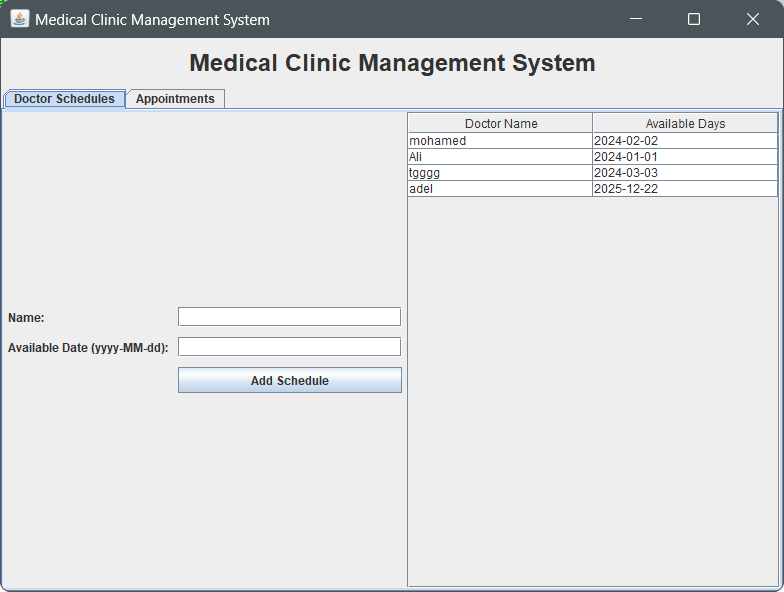
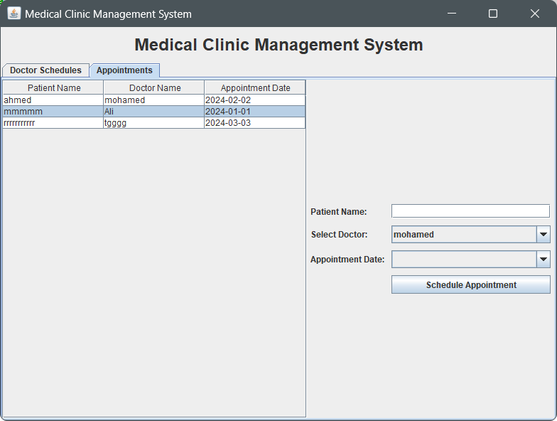

# Medical Clinic Management System

A Java-based desktop application designed to manage patient records, doctor schedules, and appointments. This system utilizes multiple design patterns, including Singleton, Factory, Builder, Adapter, Proxy, and Prototype, ensuring scalability, maintainability, and code reusability.

## Features

- **Doctor Schedules**: Add and view doctors' available schedules.
- **Patient Appointments**: Schedule, view, and manage patient appointments.
- **Database Integration**: Persistent storage of schedules and appointments using SQL Server.
- **Clean UI**: A user-friendly graphical interface built with Java Swing.

## Design Patterns Used

1. **Singleton Pattern**: For database connection management.
2. **Factory Pattern**: For creating doctor and patient objects.
3. **Builder Pattern**: For constructing appointments with multiple optional fields.
4. **Prototype Pattern**: For duplicating existing records.
5. **Adapter Pattern**: For integrating different data formats with the UI.
6. **Proxy Pattern**: For secure access to database records.

## Technologies Used

- **Programming Language**: Java
- **Database**: SQL Server
- **UI Framework**: Swing
- **Build Tool**: Maven (optional)

## Prerequisites

- Java 11 or later
- SQL Server installed and running
- Database configuration in the application

## Getting Started

### 1. Clone the Repository

```bash
git clone https://github.com/your-username/Medical-Clinic-Management-System.git
cd Medical-Clinic-Management-System
```

### 2. Configure the Database

- Create a database in SQL Server named `ClinicDB`.
- Run the following SQL script to create the necessary tables:

```sql
CREATE TABLE DoctorSchedules (
    doctor_name VARCHAR(100) NOT NULL,
    available_date DATE NOT NULL
);

CREATE TABLE PatientAppointments (
    patient_name VARCHAR(100) NOT NULL,
    doctor_name VARCHAR(100) NOT NULL,
    appointment_date DATE NOT NULL
);
```

- Update the database connection settings in the `connectToDatabase` method:

```java
String url = "jdbc:sqlserver://localhost:1433;databaseName=ClinicDB";
String username = "your_username";
String password = "your_password";
```

### 3. Run the Application

- Compile and run the application:

```bash
javac MainUI.java
java MainUI
```

## Screenshots

### Doctor Schedules Tab


### Appointments Tab


## Team Members

-  [**Mohamed Magdy**](https://github.com/mohamedmagdy2301)
-  [**Yomna Mohamed**](https://github.com/yomna062)
-  [**Gehad Ahmed**](https://github.com/gehad-Ahmed30)
-  [**Nourhan Zayed**](https://github.com/Nour-Zayed)


*(Replace placeholder names with the actual team members and their roles.)*

## Future Enhancements

- **Notifications**: Add email or SMS notifications for appointments.
- **Reports**: Generate summary reports for patient visits and schedules.
- **Role-Based Access**: Implement admin and doctor-specific user roles.

## License

This project is licensed under the [MIT License](LICENSE).

## Contribution

Contributions are welcome! Please create a fork of the repository and submit a pull request with your changes.

## Contact

For any questions or feedback, feel free to reach out:

- **Email**: [mohammedmego15@gmail.com](mohammedmego15@gmail.com)
- **LinkedIn**: [My LinkedIn](https://www.linkedin.com/in/mohamed-magdy-0ba1042a0/)
